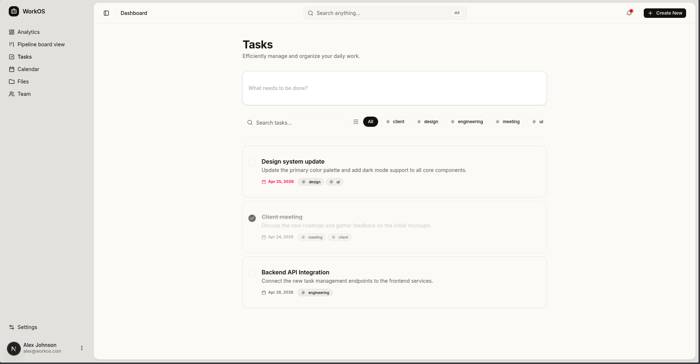

<h1 align="center">
  <br />
  WorkSync
  <br />
</h1>

<p align="center">
  A premium, open-source work management system — designed for absolute clarity and team efficiency.
</p>

<p align="center">
  <a href="#"></a>
  &nbsp;
  <a href="#"></a>
  &nbsp;
  <a href="#"></a>
  &nbsp;
  <a href="#"></a>
  &nbsp;
  <a href="#"></a>
</p>



<hr />

<h4 align="center">
  <a href="#-features"><strong>Features</strong></a> &nbsp;·&nbsp;
  <a href="#-tech-stack"><strong>Tech Stack</strong></a> &nbsp;·&nbsp;
  <a href="#-quick-start"><strong>Quick Start</strong></a> &nbsp;·&nbsp;
  <a href="#-architecture"><strong>Architecture</strong></a> &nbsp;·&nbsp;
  <a href="#-contributing"><strong>Contributing</strong></a>
</h4>

<hr />

> [!TIP]
> WorkSync is a perfect foundation for building your own organization's internal management tool. Fork it, extend it, and make it yours.

WorkSync is an open-source, high-performance work management platform built with **Next.js 16**, **React 19**, and **Tailwind CSS v4**. It provides a unified workspace for teams to manage tasks, files, calendars, and analytics in a beautifully designed, ergonomic interface.

Think of it as a lean, hackable, and visually stunning alternative to enterprise project management tools — built from first principles with modern web technologies.

---

## ✨ Features

- **Dynamic Dashboard** — Real-time analytics and activity tracking with professional data visualization using Recharts.
- **Kanban Pipelines** — Fully interactive drag-and-drop task management built with `@dnd-kit`.
- **High-Density Task Management** — Ergonomic, performant task tables with advanced filtering and sorting via TanStack Table.
- **Integrated File Explorer** — Seamless cloud storage simulation with directory navigation and file drag-and-drop support.
- **Intelligent Calendar** — Manage team schedules and deadlines with a clean, intuitive monthly grid view.
- **Team Administration** — Efficiently manage team members, roles, and status in a dedicated management interface.
- **Premium UI/UX** — Modern aesthetics with dark mode support, glassmorphism, smooth micro-animations, and responsive layouts.
- **Open Source** — 100% open source and customizable to fit your organization's unique workflow.

---

## Tech Stack

| Layer | Technology |
|-------|------------|
| **Framework** | Next.js 16 (App Router) |
| **Frontend** | React 19, TypeScript |
| **Styling** | Tailwind CSS v4, Vanilla CSS |
| **Icons** | Lucide Icons |
| **Components** | Radix UI, Shadcn UI |
| **Data Visualization** | Recharts |
| **Tables** | TanStack Table (React Table) |
| **Drag & Drop** | @dnd-kit |

---

## Quick Start

### Prerequisites

- Node.js 20+
- pnpm (recommended)

### 1. Clone the repository

```bash
git clone https://github.com/parsherr/work-management-system.git
cd work-management-system
```

### 2. Install dependencies

```bash
pnpm install
```

### 3. Run the development server

```bash
pnpm dev
```

Open [http://localhost:3000](http://localhost:3000) in your browser to see the result.

---

## Architecture

```
work-management-system/
├── app/             # Next.js App Router (Pages & API Routes)
├── components/      # React components
│   ├── landing/     # Landing page specific components
│   ├── dashboard/   # Dashboard & Kanban components
│   ├── tasks/       # Task management components
│   ├── files/       # File explorer components
│   ├── team/        # Team management components
│   └── ui/          # Reusable Shadcn/Radix UI primitives
├── hooks/           # Custom React hooks
├── lib/             # Utility functions and shared logic
├── public/          # Static assets (images, icons)
└── styles/          # Global styles and Tailwind configuration
```

---

## Roadmap

- [ ] Real-time collaboration with WebSockets
- [ ] Multi-tenant workspace support
- [ ] Advanced file preview for PDF and Documents
- [ ] Integration with GitHub/Slack notifications
- [ ] Custom fields for tasks and team members
- [ ] Gantt chart view for project timelines

---

## Contributing

Contributions are welcome! Whether it's fixing a bug, adding a feature, or improving documentation:

1. Fork this repository
2. Create a branch: `git checkout -b feat/my-feature`
3. Make your changes and commit: `git commit -m 'feat: add my feature'`
4. Push to your fork: `git push origin feat/my-feature`
5. Open a pull request

---

## License

WorkSync is open-source software licensed under the [MIT License](./LICENSE).

---

<p align="center">
  Built with React 19 + Next.js 16 &nbsp;·&nbsp; Designed for Clarity
</p>
